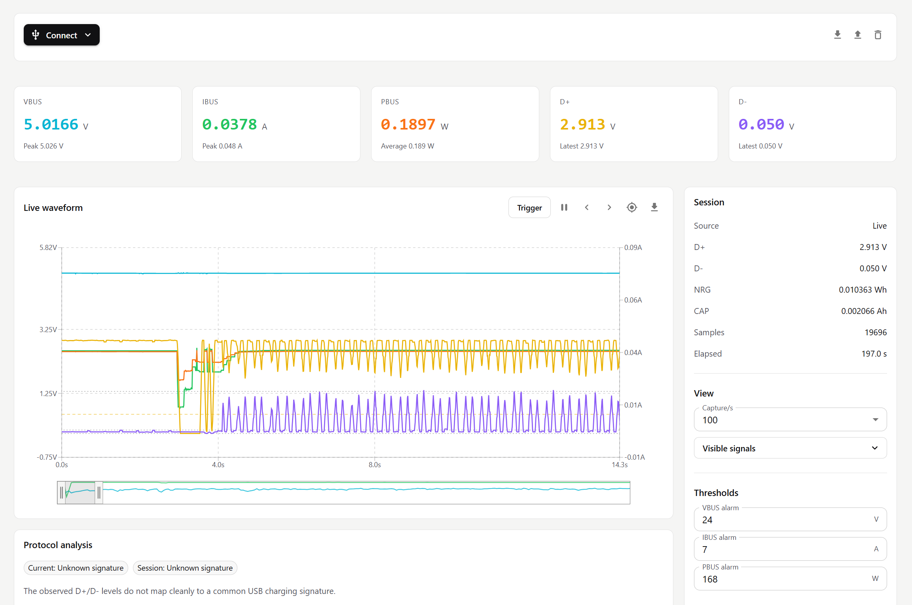

<p align="center">
  
</p>

# OpenFNB

OpenFNB is a web dashboard for FNIRSI USB power meters. It connects from Chrome or Edge using WebHID or Web Bluetooth and shows live measurements, waveform navigation, trigger handling, protocol analysis, and export tools.



## Features

- Live VBUS, IBUS, PBUS, D+, D-, capacity, and energy tracking.
- Interactive waveform with pan, zoom, follow latest, range selection, hover values, and PNG export.
- Trigger detection on D+, D-, VBUS, or IBUS.
- Trigger actions to jump to trigger, mark only, pause capture, or clear capture.
- Protocol analysis for D+/D- charging signatures.
- Threshold alarms for VBUS, IBUS, and PBUS.
- CSV export, compact JSON record export/import, and waveform PNG export.
- FNB58 bootloader firmware upload for `.ufn`/`.unf` firmware files.
- Light/dark theme and saved app defaults.

## Supported Devices

USB/WebHID:

- FNIRSI C1 (not tested)
- FNIRSI FNB48 (not tested)
- FNIRSI FNB48S (not tested)
- FNIRSI FNB58 (tested)

Bluetooth:

- FNB58-style BLE telemetry (tested)

Firmware upgrade:

- FNIRSI FNB58 bootloader mode, VID `0x0483`, PID `0x0038`.

## Requirements

- Chrome or Edge.
- `https://` or `http://localhost`.
- USB data cable for WebHID, or a Bluetooth-capable meter for BLE.

## Run

```bash
npm install
npm run dev
```

Build:

```bash
npm run build
```

Test:

```bash
npm test
```

## Use

1. Open the app in Chrome or Edge.
2. Click `Connect`.
3. Choose `USB` or `Bluetooth`.
4. Select the meter from the browser prompt.

Connecting again after a capture asks before clearing the previous live data.

## Firmware Upgrade

1. Put the FNB58 into bootloader mode.
2. Click `Connect`, choose `USB`, and select the bootloader device from the browser prompt.
3. Select a `.ufn` or `.unf` firmware file in the firmware dialog.
4. Click `Upgrade`.

## Defaults

- Theme: light.
- Capture rate: 100 samples/s.
- Visible signals: VBUS, IBUS, PBUS, D+, D-.
- Thresholds: VBUS 24 V, IBUS 7 A, PBUS 168 W.

## Notes

- Settings are stored in browser local storage.
- JSON record import supports the compact OpenFNB v2 format.
- WebHID is not available in Firefox or Safari.
- Bluetooth currently focuses on live telemetry; USB provides the most complete signal set.
